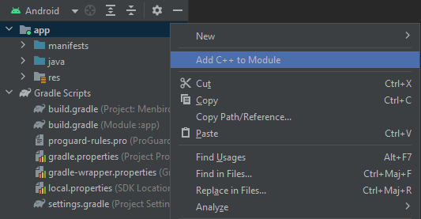

# FirebirdAndroid

# Insert your database/UDF/UDR

**System libs** :
Put your system libs inside the folder corresponding to the architecture of the libs inside the **jni** folder

**Database** :
Put your .fdb files inside the **assets/databases/**

**UDF** :
first go inside **assets/firebird_ARCHITECTURE** corresponding at your os architecture then go to **UDF** folders and put the .so libs inside

**UDR** :
first go inside **assets/firebird_ARCHITECTURE** corresponding at your os architecture then go to **plugins/udr** folders and put the .so libs inside

# INSTALL

> **Note**
> If you already have a project with C++ module you can go to **Move file** section

First create a new project

> **Note**
> the name of your project in lower characters will be name YourProjectName in this readme

When your project is load you need to add C++ in your application 

> **Note**
> you can remove the .cpp file created by default if you just want use the api with java not in C++

* right-click on app
* click on add C++ to module
* click on ok on the new windows wich open
* if success you will have project tree like this




  
## Move file in your project

Move all files and folders of the cpp folders inside your cpp folder wich can be found under **YourAndroidApplicationFolder/app/src/main/**

Move Firebird.kt file inside the java folder of your application wich can be found under **YourAndroidApplicationFolder/app/src/main/java/com/example/YourProjectName/**

Move .aar file inside the libs folder of your application wich can be found under **YourAndroidApplicationFolder/app/libs/**

After that your project must contains the files like this :


## Edit files

**CMAKEList.txt**

In **add_library()** add at the end before the **)** :

```
firebirdCore.cpp
request.cpp
```

Under **find_library()** add this and replace ProjectName by your YourProjectName :

```
target_include_directories(
        <Project name> PUBLIC
        $<BUILD_INTERFACE:${CMAKE_CURRENT_SOURCE_DIR}/include>)
```

**firebirdCore.cpp**

In this file change the name of JNIEXPORT function by replacing PROJECTNAME by your YourProjectName (there are 5 functions)

```
//For project name firedroid
extern "C" JNIEXPORT jint JNICALL Java_com_example_PROJECTNAME_Firebird_getApiVersion(JNIEnv* env, jobject self)
//become
extern "C" JNIEXPORT jint JNICALL Java_com_example_firedroid_Firebird_getApiVersion(JNIEnv* env, jobject self)
```

**Firebird.kt**
First of all at the end of the first line add your YourProjectName after the .

Then in init function update your YourProjectName in System.loadLibrary("ProjectName")

```
//For project name firedroid
package com.example.firedroid
and
System.loadLibrary("ProjectName")
//become
System.loadLibrary("firedroid")
```

**AndroidManifest.xml**

Before application tag insert this :

```
<uses-permission android:name="android.permission.INTERNET" />
<uses-permission android:name="android.permission.ACCESS_NETWORK_STATE" />
<uses-permission android:name="android.permission.READ_EXTERNAL_STORAGE" />
<uses-permission android:name="android.permission.WRITE_EXTERNAL_STORAGE" />
<uses-permission android:name="android.permission.MANAGE_EXTERNAL_STORAGE" />
```

**build.gradle of app**

found the line with cppFlags and add after '-std=c++17'
the line looks like this after change
```
cppFlags '-std=c++17'
```
in dependencies add the aar file by add this line inside brackets :

```
implementation files('libs/Firebird-3.0.0-android-embedded.aar')
```

# ADD DEBUG INTERFACE

**Add kotlin file**

Move DebugInterface.kt file inside the java folder of your application wich can be found under **YourAndroidApplicationFolder/app/src/main/java/com/example/YourProjectName/**

At the end of the first line add your YourProjectName after the .

**Modify AndroidManifest.xml**

In application tag add activity :

```
<activity
	android:name=".DebugInterface"
        android:exported="true"
        android:theme="@style/Theme.AppCompat">
        <intent-filter>
        	<action android:name="android.intent.action.MAIN" />
                <category android:name="android.intent.category.LAUNCHER" />
	</intent-filter>
</activity>
```

**modifiy build.graddle app**

Inside the android brackets add this

```
buildFeatures {
        compose true
    }
    composeOptions {
        kotlinCompilerExtensionVersion '1.4.6'
    }
```
Inside the dependencies brackets add this

```
implementation 'androidx.activity:activity-compose:1.7.2'
    implementation "androidx.compose.animation:animation:1.4.3"
    implementation "androidx.compose.foundation:foundation:1.4.3"
    implementation 'androidx.compose.material3:material3:1.1.1'
    implementation "androidx.compose.runtime:runtime:1.4.3"
    implementation "androidx.compose.ui:ui:1.4.3"
```

# Use the API with your application
**Add to your java file**

To use the api inside your java file you need to create a variable wich represent the class Firebird

To construct this class you need 
* A ContextWrapper class to be use to found the user's directory
* The database name
* The username
* The user's password

**Add to your cpp file**
